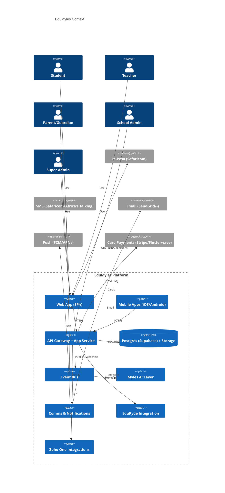

# EduMyles Architecture Overview

This document summarizes the system architecture aligned to Enhanced Master Document v2.0.

## Context Diagram

## Tenancy & Data
- Single Postgres per region with schemas: `platform` (global), `tenant_data` (isolated), `analytics` (denormalized).
- Supabase Auth → JWT → Postgres RLS. RBAC + context-aware rules (campus/department).
- White-label and reseller config: branding/themes, domains, commissions.

## Domains (Phase 1 focus)
- Identity/Access, Tenant/Org, Academic Core, Assessment (basic), Attendance, Finance (M-Pesa MVP), Comms (SMS/Email), Notifications (MVP), Ticketing (MVP), Gamification (MVP), Knowledge Hub (MVP).

## Event-Driven Backbone
- Outbox → dispatcher → subscribers (AI, Comms, Analytics, Gamification, Integrations).
- Key events: `student.*`, `academic.*`, `financial.*`, `comms.*`, `ticketing.*`, `gamification.*`.

## Deployment & Ops
- Envs: dev/staging/prod. Cloud Run/Fly/Render. Cloudflare CDN/WAF.
- Observability: OpenTelemetry + Grafana/Prometheus, Sentry, PostHog.
- Security/Compliance: RLS, MFA, audit logs, KDPA/GDPR/FERPA tooling.

## Next Docs
- See `phase1-plan.md` for milestones and `sql/phase1` for schema drafts.
